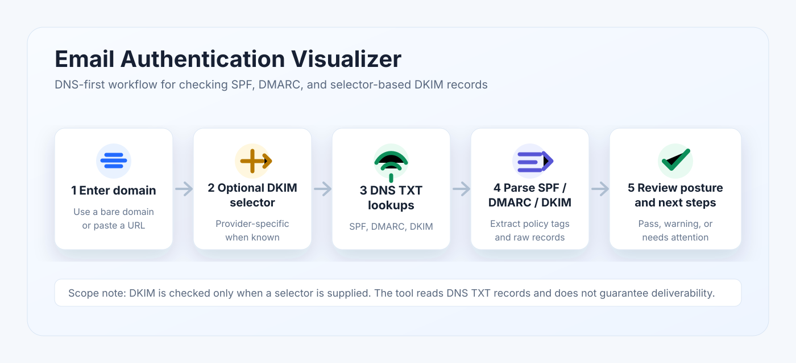
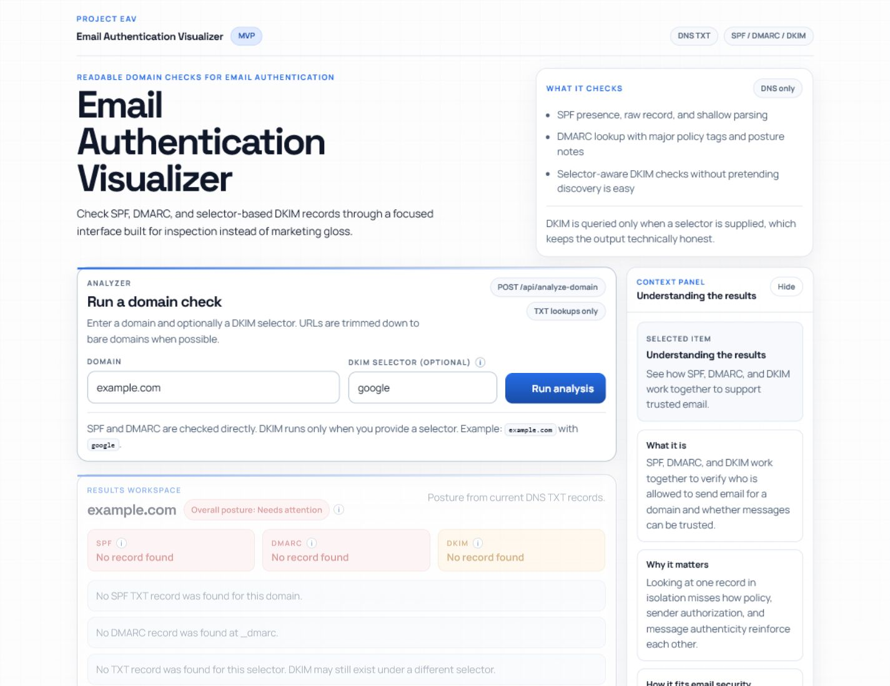
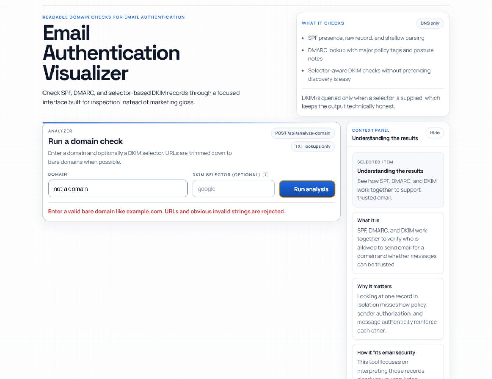
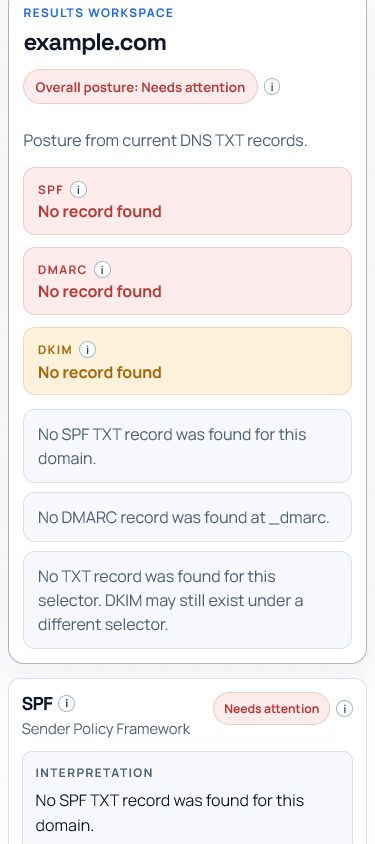

# Email Authentication Visualizer

Small full-stack Next.js MVP for checking a domain's email authentication setup.
It turns raw DNS TXT records into a readable SPF, DMARC, and selector-based DKIM
review.

Live demo: https://richfish85.github.io/email_authentication_visualizer/



## What

Email Authentication Visualizer helps a user inspect the DNS records that affect
email spoofing resistance:

- SPF on the base domain
- DMARC on `_dmarc.<domain>`
- DKIM on `<selector>._domainkey.<domain>` when a selector is supplied

The app returns raw records, parsed fields, a plain-language posture label, and
practical recommendations.

## Why

SPF, DMARC, and DKIM records are public, but they are not always easy to read.
This project is designed as a portfolio-friendly cybersecurity visualizer: it
shows the user what was checked, what was found, what looks risky, and what to
review next.

## How

1. Enter a domain, such as `example.com`.
2. Optionally enter a DKIM selector, such as `google` or `selector1`.
3. Run the analysis.
4. Review SPF, DMARC, and DKIM cards.
5. Copy raw records or parsed values for follow-up notes.

## Portfolio notes

This is intentionally scoped as an MVP rather than a complete email security
scanner. The strongest portfolio signals are:

- Clear product framing for a real security-adjacent workflow
- Server-side DNS lookups through `node:dns/promises`
- Input normalization and validation before lookup
- Honest DKIM handling: selector-based checks only, no fake discovery
- Parsed SPF and DMARC fields with user-facing recommendations
- Shareable analysis URLs through query parameters
- Lightweight tests around normalization, parsing, and posture scoring

## Screenshots

### Home / Empty State


### Results State



### Validation State



### Mobile Results



## Demo placeholders

Add these when polishing:

- Short screen recording: domain input to recommendations

## Implementation

- Next.js App Router
- TypeScript
- CSS Modules
- Node runtime API route at `POST /api/analyze-domain`
- DNS TXT lookups through `node:dns/promises`
- GitHub Pages static build uses browser-side DNS-over-HTTPS
- Vitest for focused parser and scoring tests

## Deployment

The normal Next.js build uses the local API route for DNS lookup. The GitHub
Pages build is static, so it switches to browser-side DNS-over-HTTPS at build
time with:

```bash
GITHUB_PAGES=true NEXT_PUBLIC_DNS_LOOKUP_MODE=doh npm run build
```

The Pages workflow runs lint, tests, a static export, and then publishes `out/`
through GitHub Actions.

## API

`POST /api/analyze-domain`

Request body:

```json
{
  "domain": "example.com",
  "dkimSelector": "google"
}
```

Notes:

- `domain` is required.
- `dkimSelector` is optional.
- URLs like `https://example.com/path` are normalized to a hostname when possible.
- The UI is designed around bare domains.

## Sample inputs

See [docs/sample-domains.json](docs/sample-domains.json) for reviewer-friendly
sample inputs.

Example:

```json
{
  "domain": "example.com",
  "dkimSelector": "google"
}
```

This demonstrates missing-record handling for SPF, DMARC, and a selector-specific
DKIM lookup.

## Assumptions

- DNS TXT records are the source of truth for this MVP.
- SPF and DMARC can be checked directly from predictable DNS names.
- DKIM cannot be reliably discovered without knowing provider selectors first.
- A posture label is guidance, not a guarantee of deliverability or security.
- DNS responses can change at any time, so sample outputs may drift.

## Threat and risk notes

- The app does not send email or verify mailbox-level deliverability.
- The app does not prove that all legitimate senders are covered by SPF.
- The app does not validate private DKIM signing behavior, only public selector
  records.
- A domain can have correct-looking records and still have operational gaps.
- DNS timeouts and resolver errors are treated as warnings so the user knows the
  check was inconclusive.

## Current MVP scope

- SPF: existence, raw record, includes, `ip4`, `ip6`, and final `all`
- DMARC: existence, raw record, `p`, `rua`, `ruf`, `pct`, `adkim`, `aspf`
- DKIM: selector-based lookup only; no generic selector discovery
- Recommendations: practical next steps based on missing, weak, or ambiguous
  records

## Run locally

```bash
npm install
npm run dev
```

Open `http://localhost:3000`.

## Validation steps

```bash
npm run lint
npm run test
npm run build
npm audit
```

Manual smoke test:

1. Start the app with `npm run dev`.
2. Open `http://localhost:3000`.
3. Analyze `example.com` with DKIM selector `google`.
4. Confirm the app reports missing SPF, missing DMARC, and no selector-specific
   DKIM record.
5. Try one well-known provider domain from `docs/sample-domains.json`.

## Next polish ideas

- Add screenshots and a short GIF or video walkthrough.
- Deploy the app and add the live URL above.
- Add API route tests with mocked DNS responses.
- Add a small architecture diagram showing browser, API route, DNS resolver, and
  result cards.
- Add a `SECURITY.md` with disclosure scope if this becomes public-facing.
